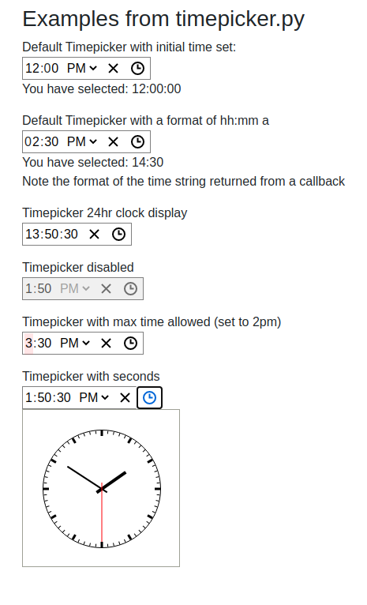

# Dash More Components

Dash More Components is library of additional components to use in your Plotly Dash app

There are 3 new components in this library:

1.  __CurrentLocation__:  Uses the browsers geolocation to get the current lat/lon of the device running a Dash app.

2. __CountdownTimer__:  Counts down from a starting number of seconds to zero. It counts down by seconds and may be
paused during the countdown.  This is ideal for triggering a callback after a certain amount of time or at a selected
 date or time.

3.  __Timepicker__:  Gives the user the ability to select a time. Ideal for use with the CountdownTimer

4.  Datetimepicker: Coming soon!

--------
---------
## CurrentLocation 


#### Component Properties

|Prop name|Description|Default value|Example values|
|----|----|----|----|
| id| id of component|n/a


-------
------


## CountdownTimer

The countdown timer is convenient way to enhance the UI of your Dash app.


#### Component Properties

|Prop name|Description|Default value|Example values|
|----|----|----|----|
| id| id of component used to identify dash components in callbacks|n/a
|starting_duration| The amount of time to count down. In seconds| 0
|n_seconds| The number of seconds elapsed|0
|remaining_duration| The amount of time remaining on the count down timer in seconds|0
|pause| If True, the counter will no longer update.   If False, the timer will resume|True


### countdown_quickstart.py


```
import dash_more_components as dmc
import dash
from dash.dependencies import Input, Output, State
import dash_html_components as html
import dash_bootstrap_components as dbc

import datetime as dt

external_stylesheets = [dbc.themes.BOOTSTRAP]

app = dash.Dash(__name__, external_stylesheets=external_stylesheets)

app.layout = html.Div(
    [
        dmc.CountdownTimer(id="countdown", pause=True, starting_duration=10),
        dbc.RadioItems(
            id="pause",
            options=[ {"label": "Start Timer", "value": "start"},
                {"label": "Pause", "value": "pause"},
            ],
            value="pause",
        ),
        html.Span(dbc.Badge(id="badge_output", color="success", className="m-2")),
        html.H3(id="timer_end_text"),
    ],
    className="m-4",
)


@app.callback(
    Output("badge_output", "children"),
    Output("timer_end_text", "children"),
    Output("countdown", "pause"),
    Input("pause", "value"),
    Input("countdown", "n_seconds"),
    State("countdown", "remaining_duration"),
)
def update_display(pause, n, remaining_time):
    pause = True if pause == "pause" else False

    badge_text = (
        f"Checking for updates in {str(dt.timedelta(seconds=remaining_time))}"
        if remaining_time
        else ""
    )
    timer_end_text = "Results are in!" if (n) and (remaining_time == 0) else ""
    return badge_text, timer_end_text, pause


if __name__ == "__main__":
    app.run_server(debug=True)
```

#### See more examples with countdown.py:


----------------------
--------------------


## Timepicker

Displays an input field complete with custom inputs and a clock.
Based on react time picker:   https://github.com/wojtekmaj/react-time-picker


#### Component Properties

|Prop name|Description|Default value|Example values|
|----|----|----|----|
| id| id of component|n/a
|disabled|Whether the time picker should be disabled.|`false`|`true`|
|disableClock|When set to `true`, will remove the clock and the button toggling its visibility.|`false`|`true`|
|format|Input format based on [Unicode Technical Standard #35](https://www.unicode.org/reports/tr35/tr35-dates.html#Date_Field_Symbol_Table). Supported values are: `H`, `HH`, `h`, `hh`, `m`, `mm`, `s`, `ss`, `a`.|n/a|`"h:m:s a"`|
|locale|Locale that should be used by the time picker and the clock. Can be any [IETF language tag](https://en.wikipedia.org/wiki/IETF_language_tag).|User's browser settings|`"hu-HU"`|
|maxDetail|How detailed time picking shall be. Can be `"hour"`, `"minute"` or `"second"`.|`"minute"`|`"second"`|
|maxTime|Maximum time that the user can select.|n/a|String: `"22:15:00"`|
|minTime|Minimum date that the user can select.|n/a|String: `"22:15:00"`
|value|Input value.|n/a|String: `"22:15:00"`|




### timepicker.py:   example code for the timepicker component
```
import dash_more_components as dmc
import dash
from dash.dependencies import Input, Output
import dash_html_components as html
import dash_bootstrap_components as dbc

external_stylesheets = [dbc.themes.BOOTSTRAP]

app = dash.Dash(__name__, external_stylesheets=external_stylesheets)

app.layout = html.Div(
    [
        html.H3("Examples from timepicker.py"),
        html.P(
            [
                "Default Timepicker with initial time set:",
                dmc.Timepicker(id="example1", value="12:00:00"),
                html.Div(id="output1"),
            ]
        ),
        html.P(
            [
                "Default Timepicker with a format of hh:mm a",
                dmc.Timepicker(id="example2", format="hh:mm a"),
                html.Div(id="output2"),
                "Note the format of the time string returned from a callback",
            ]
        ),
        html.P(
            [
                "Timepicker 24hr clock display",
                dmc.Timepicker(id="example3", value="13:50:30", format="HH:mm:ss"),
            ]
        ),
        html.P(
            [
                "Timepicker disabled",
                dmc.Timepicker(id="example4", value="13:50:30", disabled=True),
            ]
        ),
        html.P(
            [
                "Timepicker with max time allowed (set to 2pm)",
                dmc.Timepicker(id="example5", maxTime="14:00:00"),
            ]
        ),
        html.P(
            [
                "Timepicker with seconds",
                dmc.Timepicker(id="example6", value="13:50:30", maxDetail="second"),
            ]
        ),
    ],
    className="m-5",
)


@app.callback(
    Output("output1", "children"),
    Output("output2", "children"),
    Input("example1", "value"),
    Input("example2", "value"),
)
def update_output(time1, time2):
    msg_a = "Please select a time"
    msg_b = "You have selected: "

    clock1 = msg_b + time1 if time1 else msg_a
    clock2 = msg_b + time2 if time2 else msg_a
    return clock1, clock2


if __name__ == "__main__":
    app.run_server(debug=True)

```


-------------------------------------------------------------------------------------------
