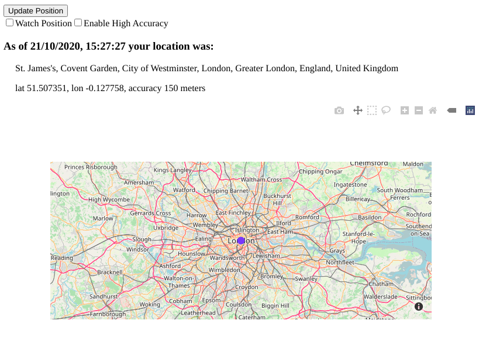

# Dash More Components

Dash More Components is library of additional components to use in Plotly Dash apps


1.  __CurrentLocation__:  Uses the browsers geolocation to get the current position of the device running a Dash app.

2. __CountdownTimer__:  Counts down from a starting number of seconds to zero. It counts down by seconds and may be
paused during the countdown.  This is ideal for triggering a callback after a certain amount of time or at a selected
 date or time.

3.  __Timepicker__:  Gives the user the ability to select a time. 

4.  Datetimepicker: Coming soon!

5. __CreditCard__:  Cool credit card data entry component.

--------
---------
## CurrentLocation 

The CurrentLocation component uses the [Geolocation API](https://developer.mozilla.org/en-US/docs/Web/API/Geolocation_API) 
to call navigator.geolocation.  This will cause the user's browser to ask them for permission to access their location data.
 If they accept, then the browser will use the best available functionality on the device to access this information 
 (for example, GPS).


#### Component Properties

|Prop name|Description|Default value|Example values|
|----|----|----|----|
| id| id of component|n/a
|date|The local date and time that the device position was updated| datetime string|10/20/2020, 7:02:48 AM|
|position| A dictionary with the following keys: <br> latitude in degrees<br> longitude in degrees<br> accuracy of the lat/lon in meters<br><br>When available:<br>altitude in meters<br>altitudeAccuracy in meters<br> heading in degrees<br>speed in meters per sec|n/a||
|watch_position|If false, position is obtained as an asynchronous request.  If true, then  position data is updated when either the location changes or more accurate information becomes available|False| either True or False|
|update_now| Forces a one-time update to the position data.   If set to True in a callback, the browser will update the position data and reset update_now back to False.  This can, for example, be used to update the position with a button click or an interval timer.|False|True or False|
|high_accuracy|If true and if the device is able to provide a more accurate position,it will do so. Note that this can result in slower response times or increased power consumption (with a GPS chip on a mobile device for example). If falsethe device can take the liberty to save resources by responding more quickly and/or using less power.|False|True or False|


#### CurrentLocation quickstart:

```import dash_more_components as dmc
import dash
from dash.dependencies import Input, Output
import dash_html_components as html

app = dash.Dash(__name__)

app.layout = html.Div(
    [
        html.Button("Update Position", id="update_btn"),
        dmc.CurrentLocation(id="current_loc"),
        html.Div(id="text_position"),
    ]
)


@app.callback(Output("current_loc", "update_now"), Input("update_btn", "n_clicks"))
def update_now(click):
    return True if click and click > 0 else False


@app.callback(
    Output("text_position", "children"),
    Input("current_loc", "date"),
    Input("current_loc", "position"),
)
def display_output(date, pos):
    if pos:
        return html.P(
            f"As of {date} your location was: lat {pos['latitude']},lon {pos['longitude']}, accuracy {pos['accuracy']} meters",
        )
    else:
        return "No position data available"


if __name__ == "__main__":
    app.run_server(debug=True)
```

#### Using CurrentLocation to show address and position on a map

The quickstart example above just returns a string with the date, time ,latitude, longitude and accuracy.
This app shows how to plot the location on a map and to get the address.  See current_location.py in 
the examples folder.  





-------
------


## CountdownTimer

The countdown timer is convenient way to enhance the UI of your Dash app.  It is similar to the dcc.Interval component, 
but it counts down to zero from a starting time.  All times are in seconds. 


#### Component Properties

|Prop name|Description|Default value|Example values|
|----|----|----|----|
| id| id of component used to identify dash components in callbacks|n/a
|starting_duration| The amount of time to count down. In seconds| 0
|n_seconds| The number of seconds elapsed|0
|remaining_duration| The amount of time remaining on the count down timer in seconds|0
|pause| If True, the counter will no longer update.   If False, the timer will resume|True


#### countdown_quickstart.py


```
import dash
import dash_more_components as dmc
from dash.dependencies import Input, Output, State
import dash_html_components as html
import dash_bootstrap_components as dbc
import datetime as dt

external_stylesheets = [dbc.themes.BOOTSTRAP]

app = dash.Dash(__name__, external_stylesheets=external_stylesheets)

app.layout = html.Div(
    [
        dmc.CountdownTimer(id="countdown", pause=True, starting_duration=10),
        dbc.RadioItems(
            id="pause",
            options=[{"label": i, "value": i} for i in (["Start", "Pause"])],
            value="Pause",
        ),
        html.Span(dbc.Badge(id="badge_output", color="success", className="m-2")),
        html.H3(id="timer_end_text"),
    ],
    className="m-4",
)


@app.callback(
    Output("badge_output", "children"),
    Output("timer_end_text", "children"),
    Output("countdown", "pause"),
    Input("pause", "value"),
    Input("countdown", "n_seconds"),
    State("countdown", "remaining_duration"),
)
def update_display(pause_selected, n, remaining_time):
    pause = True if pause_selected == "Pause" else False

    badge_text = (
        f"Checking for updates in {str(dt.timedelta(seconds=remaining_time))}"
        if remaining_time
        else ""
    )
    timer_end_text = "Results are in!" if (n) and (remaining_time == 0) else ""
    return badge_text, timer_end_text, pause


if __name__ == "__main__":
    app.run_server(debug=True)```
```
#### See more examples with countdown.py:


----------------------
--------------------


## Timepicker

Displays an input field complete with custom inputs and a clock.
Based on react time picker:   https://github.com/wojtekmaj/react-time-picker


#### Component Properties

|Prop name|Description|Default value|Example values|
|----|----|----|----|
| id| id of component|n/a
|disabled|Whether the time picker should be disabled.|`false`|`true`|
|disableClock|When set to `true`, will remove the clock and the button toggling its visibility.|`false`|`true`|
|format|Input format based on [Unicode Technical Standard #35](https://www.unicode.org/reports/tr35/tr35-dates.html#Date_Field_Symbol_Table). Supported values are: `H`, `HH`, `h`, `hh`, `m`, `mm`, `s`, `ss`, `a`.|n/a|`"h:m:s a"`|
|locale|Locale that should be used by the time picker and the clock. Can be any [IETF language tag](https://en.wikipedia.org/wiki/IETF_language_tag).|User's browser settings|`"hu-HU"`|
|maxDetail|How detailed time picking shall be. Can be `"hour"`, `"minute"` or `"second"`.|`"minute"`|`"second"`|
|maxTime|Maximum time that the user can select.|n/a|String: `"22:15:00"`|
|minTime|Minimum date that the user can select.|n/a|String: `"22:15:00"`
|value|Input value.|n/a|String: `"22:15:00"`|


countdown_timepicker.py
```
import dash_more_components as dmc
import dash
from dash.dependencies import Input, Output, State
import dash_html_components as html
import dash_bootstrap_components as dbc
import datetime as dt

external_stylesheets = [dbc.themes.BOOTSTRAP]

app = dash.Dash(__name__, external_stylesheets=external_stylesheets)


time_input_card = html.Div(
    dbc.Card(
        [
            html.H4("Check for results at: "),
            dbc.Row(
                dbc.Col(
                    [
                        dmc.Timepicker(
                            id="time_picker",
                            value="12:00:00",
                            maxDetail="second",
                        ),
                        dbc.Button(
                            "Start countdown timer",
                            id="start_btn",
                            n_clicks=0,
                            color="primary",
                            size="sm",
                        ),
                    ],
                ),
            ),
        ],
        body=True,
        className="m-3",
    )
)

app.layout = dbc.Container(
    [
        dmc.CountdownTimer(id="countdown", pause=True, starting_duration=0),
        time_input_card,
        dbc.Badge(id="countdown_to_time", color="success", className="m-2"),
    ],
    fluid=True,
)


@app.callback(
    Output("countdown_to_time", "children"),
    Output("countdown", "starting_duration"),
    Output("countdown", "pause"),
    Input("countdown", "remaining_duration"),
    Input("start_btn", "n_clicks"),
    State("time_picker", "value"),
)
def update_date_countdown(remaining, click, time_selected):
    ctx = dash.callback_context
    input_id = ctx.triggered[0]["prop_id"].split(".")[0]

    text = f"Checking at: {time_selected}...    Results in: {str(dt.timedelta(seconds=remaining))}"

    if input_id == "start_btn":
        time_obj = dt.datetime.strptime(time_selected, "%H:%M:%S")
        time_now = dt.datetime.now()
        time_dif = time_obj - time_now
        starting_duration = time_dif.seconds
        return text, starting_duration, False
    else:
        text = text if click > 0 else ""
        return text, dash.no_update, dash.no_update


if __name__ == "__main__":
    app.run_server(debug=True)

```

#### See more examples in countdown.py in the examples folder


-----------
----------

## CreditCard

CreditCard component provides beautiful credit cards for your payment forms.  Based on the react component here: https://github.com/amarofashion/react-credit-cards


#### Component Properties

|Prop name|Description|Default value|Example values|
|----|----|----|----|
| id| id of component used to identify dash components in callbacks|
|cvs| CVS on credit card.  Typically 3-4 digits on the back of card|
|expiry| expiry date|
|focus| which field has focus for data entry|
|name| name on the card|
|number| credit card account number|
|locale| localization text - like 'valid tru' on the card|


#### creditcard.py:

```
import dash_more_components as dmc
import dash
from dash.dependencies import Input, Output
import dash_html_components as html
import dash_bootstrap_components as dbc

app = dash.Dash(__name__, external_stylesheets=[dbc.themes.BOOTSTRAP])

name_input = dbc.FormGroup(
    [
        dbc.Label("Name", width=2),
        dbc.Col(
            dbc.Input(
                type="text", id="name", placeholder="Enter name", autoComplete="off"
            ),
            width=10,
        ),
    ],
    row=True,
)
number_input = dbc.FormGroup(
    [
        dbc.Label("Account", width=2),
        dbc.Col(
            [
                dbc.Input(
                    type="text",
                    id="number",
                    placeholder="Enter account number",
                    maxLength=16,
                    autoComplete="off",
                    value="",
                ),
                dbc.FormText(
                    "To see different cards, try starting the credit card number with: 49..., 51... 36... 37...",
                    color="secondary",
                ),
            ],
            width=10,
        ),
    ],
    row=True,
)
expiry_input = dbc.FormGroup(
    [
        dbc.Label("Expiry", width=2),
        dbc.Col(
            dbc.Input(
                type="text",
                id="expiry",
                placeholder="Enter expiry MMYY",
                value="",
                maxLength=4,
                autoComplete="off",
            ),
            width=5,
        ),
    ],
    row=True,
)
cvc_input = dbc.FormGroup(
    [
        dbc.Label("CVC", width=2),
        dbc.Col(
            dbc.Input(
                type="text",
                id="cvc",
                placeholder="Enter 3 digit code on back",
                value="",
                maxLength=3,
                autoComplete="off",
            ),
            width=5,
        ),
    ],
    row=True,
)
form = dbc.Form([number_input, name_input, expiry_input, cvc_input], className="mt-4")

app.layout = dbc.Container(
    [
        dbc.Row(html.H3("Cool Credit Card Data Entry Widget")),
        dbc.Row(
            [
                dbc.Col(
                    [
                        dmc.CreditCard(
                            id="credit_card",
                            cvc="",
                            expiry="",
                            focus="",
                            name="",
                            number="",
                            locale={"valid": "VALID THRU"},
                        ),
                        form,
                    ],
                    width={"size": 5, "offset": 1},
                    className="m-4",
                ),
            ]
        ),
    ]
)


@app.callback(
    [
        Output("credit_card", "name"),
        Output("credit_card", "number"),
        Output("credit_card", "expiry"),
        Output("credit_card", "cvc"),
        Output("credit_card", "focus"),
    ],
    [
        Input("name", "value"),
        Input("number", "value"),
        Input("expiry", "value"),
        Input("cvc", "value"),
    ],
)
def display_output(name, number, expiry, cvc):
    ctx = dash.callback_context
    input_focus = ctx.triggered[0]["prop_id"].split(".")[0]
    if input_focus is None:
        input_focus = "name"
    return name, number, expiry, cvc, input_focus


if __name__ == "__main__":
    app.run_server(debug=True)

```
