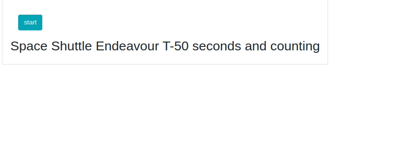

# Dash More Components
### Note:  This is a pre-release preview - question, comments, suggestions are welcome :-)

Dash More Components is library of additional components to use in Plotly Dash apps


1. __Timer__:  This component has all of the features of dcc.Interval plus some new properties that add countdown
and stopwatch features to enhance UI and app performance.    This is ideal for triggering a callback after a certain amount
 of time or at a selected date or time.

2.  __Geolocation__:  Uses the browsers geolocation to get the current position of the device running a Dash app.

3.  __Timepicker__:  Gives the user the ability to select a time. 

4.  Datetimepicker: Coming soon!

5. __CreditCard__:  Cool credit card data entry component.

--------
---------

## Timer

This component is based on the discussion in [#857](https://github.com/plotly/dash-core-components/issues/857)

The Timer is convenient way to enhance the UI and the performance of your Dash app.  It has all of the features of the
dcc.Interval component plus some new properties including a timer that either counts up or counts down. 
 
This component will enable you to do such things as:
 
 - Specify custom messages that will display at certain times.
 - Automatically convert milliseconds into human readable times. 1337000000ms can be display as: '15d 11h 23m 20s'
 see other available formats in the `timer_format` prop.
 - Specify certain times to trigger a callback.  This makes it easy to start or stop jobs at a specified elapse time.
 - Improve load and performance times because it is not necessary to fire a callback every second just to update 
 a countdown/stopwatch message.

 

#### Component Properties

|Prop name|Type & Default value|Description|Example values|
|----|----|----|----|
| id| string; optional|id of component used to identify dash components in callbacks| |
|interval| number; default 1000| This component will increment the counter `n_intervals` every `interval` milliseconds| |
|disabled |boolean; optional| If True, the n_interval counter  and the timer no longer updates.  This pauses the timer.| |
|n_intervals| number; default 0| Number of times the interval has passed (read-only)| |
|max_intervals| number; default -1| Number of times the interval will be fired. If -1, then the interval has no limit and if 0 then the interval stops running.||
|timer| number; default 0| When in countdown mode, the timer will count down to zero from the starting `duration` and will  show the number of milliseconds remaining.  When in stopwatch mode, the timer will count up from zero and show the number of milliseconds elapsed. (read only) | |
|mode| 'stopwatch' or 'countdown'; default 'countdown'| The timer will count down to zero in `countdown` mode and count up from zero in `stopwatch` mode| |
|duration| number; default -1|  Sets the number of milliseconds the timer will run.  If -1 the timer will not be limited by the duration and if 0 then the timer stops running and may be reset.||
|reset| boolean; default True| This will start the timer at the beginning with the given prop settings.| |
|fire| list; optional| A list of the time(s) in milliseconds at which to fire a callback. This can be used to start a task at a given time rather than using the timer.  Since the timer is typically set at a small interval like one second, using `fire` can reduce the number of times a callback is fired and can increase app performance.  The time(s) must be a multiple of the interval.| |
|at_fire_interval| number; optional| This number is updated when the timer reaches a time in milliseconds included in the `fire` property.  (Read only)| |
|rerun|boolean; default False| When True, the  timer repeats once the timer has run for the number of milliseconds set in the `duration`.| |
|messages|dict; optional| Timer messages to be displayed by the component rather than showing the timer. It is a dictionary in the form of: { integer: string} where integer is the time in milliseconds of when the `string` message is to be displayed.  Note:  `timer_format` will override `messages`.| {10000 : "updating in 10 seconds"} will display the message "updating in 10 seconds" once the timer equals 10000.|
|timer_format|dict; optional| If a timer is displayed, it will override timer `messages`.  This formats the timer (milliseconds) into human readable formats.| |
| | {'display': boolean}; default False|If False, then no timer will be displayed.  Timer `messages` will be displayed (if any).  If True, for example, 1337000000 milliseconds will display as: '15d 11h 23m 20s'|'15d 11h 23m 20s'|
| | {'compact':boolean}; optional| Shows a compact timer display. If True, it will only show the first unit:| 1h 10m → 1h|
| | {verbose: boolean}; optional; default False| Verbose will display full-length units.|5h 1m 45s → 5 hours 1 minute 45 seconds|
| | {colonNotation:boolean}; optional' default False|  Display time in a colon notation. Useful when you want to display time without the time units, similar to a digital watch. Will always shows time in at least minutes: 1s → 0:01|5h 1m 45s → 5:01:45|


#### Quick Start

Here are a few examples of the Timer component features.  See the reference for all the properties available. 
These timers and messages are configured and formatted using the properties of the components only.  The 
updates are all done clientside by the Timer component. No callbacks are used!  


See the code for all the examples [here](https://github.com/AnnMarieW/dash-more-components/blob/master/examples/timer_demo.py)
```
import dash
import dash_more_components as dmc
import dash_html_components as html

external_stylesheets = ["https://codepen.io/chriddyp/pen/bWLwgP.css"]

app = dash.Dash(__name__, external_stylesheets=external_stylesheets)

app.layout = html.Div(
    [
        html.Div("Updating in...", style={"display": "inline-block"}),
        html.Div(
            dmc.Timer(
                # Any output the Timer component generates will be displayed here
                mode="stopwatch",  # 'countdown  | 'stopwatch'
                duration=10000,
                timer_format={"display": True, "verbose": True},
                rerun=True,
            ),
            style={"display": "inline-block"},
        ),
    ],
)

if __name__ == "__main__":
    app.run_server(debug=True)


```


#### Space shuttle app demo:
This app uses the dmc.Timer component to launch the space shuttle.  It uses the `messages` prop to define the messages that will 
automatically be displayed at given time. The `fire` property specifies the time to trigger a callback to start the launch.
Even though the timer runs for 50 seconds (n_intervals = 50, interval=1000), it only fires the callback one time (at liftoff) All the other messages are handled 
clientside by the component.




#### Space shuttle app code:
```

import dash
from dash.dependencies import Input, Output
import dash_more_components as dmc
import dash_html_components as html
import dash_bootstrap_components as dbc

external_stylesheets = [dbc.themes.BOOTSTRAP]

app = dash.Dash(__name__, external_stylesheets=external_stylesheets)

shuttle = (
    "https://cdn.pixabay.com/photo/2012/11/28/10/33/rocket-launch-67641_960_720.jpg"
)

app.layout = html.Div(
    [
        dbc.Button("start", id="start", size="lg", color="info", className="m-4"),
        html.H1("Space Shuttle Endeavour T-50 seconds and counting"),
        html.H3([
            dmc.Timer(
                id="shuttle_countdown",
                mode="countdown",
                disabled=True,
                duration=51000,
                fire=[0],
                messages={
                    50000: "(T-50 seconds) Orbiter transfers from ground to internal power",
                    31000: "(T-31 seconds) Ground Launch Sequencer is go for auto sequence start",
                    16000: "(T-16 seconds) Activate launch pad sound suppression system",
                    10000: "(T-10 seconds) Activate main engine hydrogen burnoff system",
                    6000: "(T-6 seconds) Main engine start",
                    5000: "",
                    0: "Solid Rocket Booster ignition and LIFTOFF!",
                },
            ),
        dmc.Timer(id='clock', duration=51000, timer_format={"display": True, "colonNotation": True}, disabled=True),
        ]),
        dbc.Modal(
            dbc.ModalBody(html.Img(src=shuttle, style={"width": "100%"}),),
            id="modal",
            is_open=False,
        ),
    ],
    className="mt-4 m-4 border p-4",
)


@app.callback(
    Output("shuttle_countdown", "disabled"),
    Output("shuttle_countdown", "reset"),
    Output("clock", "disabled"),
    Input("start", "n_clicks"),
)
def start(btn_clicks):
    if btn_clicks and btn_clicks >= 0:
        return False, True, False
    else:
        return dash.no_update

# `at_fire_interval` is updated when the countdown timer reaches the time set in the `fire` prop.
#  in this callback, when the timer reaches 0, it will open the modal.
@app.callback(
    Output("modal", "is_open"), Input("shuttle_countdown", "at_fire_interval"),
)
def blastoff(at_fire_interval):
    return at_fire_interval == 0


if __name__ == "__main__":
    app.run_server(debug=True)


```


----------------------
--------------------

## Geolocation 

The Geolocation component uses the [Geolocation API](https://developer.mozilla.org/en-US/docs/Web/API/Geolocation_API) 
to call navigator.geolocation.  This will cause the user's browser to ask them for permission to access their location data.
 If they accept, then the browser will use the best available functionality on the device to access this information 
 (for example, GPS).


#### Component Properties

|Prop name|Description|Default value|Example values|
|----|----|----|----|
| id| id of component|n/a
|local_date|The local date and time that the device position was updated| datetime string|10/20/2020, 7:02:48 AM|
|timestamp| The timestamp when the date and time was updated||
|position| A dictionary with the following keys: <br> latitude in degrees<br> longitude in degrees<br> accuracy of the lat/lon in meters<br><br>When available:<br>altitude in meters<br>altitudeAccuracy in meters<br> heading in degrees<br>speed in meters per sec|n/a||
|watch_position|If false, position is obtained as an asynchronous request.  If true, then  position data is updated when either the location changes or more accurate information becomes available|False| either True or False|
|update_now| Forces a one-time update to the position data.   If set to True in a callback, the browser will update the position data and reset update_now back to False.  This can, for example, be used to update the position with a button click or an interval timer.|False|True or False|
|high_accuracy|If true and if the device is able to provide a more accurate position,it will do so. Note that this can result in slower response times or increased power consumption (with a GPS chip on a mobile device for example). If false the device can take the liberty to save resources by responding more quickly and/or using less power.|False|True or False|
|maximum_age|The maximum age in milliseconds of a possible cached position that is acceptable to return. If set to 0,it means that the device cannot use a cached position and must attempt to retrieve the real current position.  If set to Infinity the device must return a cached position regardless of its age.| 0|
|timeout| The maximum length of time (in milliseconds) the device is allowed to take in order to return a position. The default value is Infinity, meaning that data will not be return until the position is available.| Infinity|
  


#### Geolocation quickstart:

```
import dash_more_components as dmc
import dash
from dash.dependencies import Input, Output
import dash_html_components as html

app = dash.Dash(__name__)

app.layout = html.Div(
    [
        html.Button("Update Position", id="update_btn"),
        dmc.Geolocation(id="geolocation"),
        html.Div(id="text_position"),
    ]
)


@app.callback(Output("geolocation", "update_now"), Input("update_btn", "n_clicks"))
def update_now(click):
    return True if click and click > 0 else False


@app.callback(
    Output("text_position", "children"),
    Input("geolocation", "local_date"),
    Input("geolocation", "position"),
)
def display_output(date, pos):
    if pos:
        return html.P(
            f"As of {date} your location was: lat {pos['lat']},lon {pos['lon']}, accuracy {pos['accuracy']} meters",
        )
    else:
        return "No position data available"


if __name__ == "__main__":
    app.run_server(debug=True)
```

#### Using Geolocation to show address and position on a map

The quickstart example above just returns a string with the date, time ,latitude, longitude and accuracy.
This app shows how to plot the location on a map and to get the address.  See geolocation.py in 
the examples folder.  


-------
------


## Timepicker

Displays an input field complete with custom inputs and a clock.
Based on react time picker:   https://github.com/wojtekmaj/react-time-picker


#### Component Properties

|Prop name|Description|Default value|Example values|
|----|----|----|----|
| id| id of component|n/a
|disabled|Whether the time picker should be disabled.|`false`|`true`|
|disableClock|When set to `true`, will remove the clock and the button toggling its visibility.|`false`|`true`|
|format|Input format based on [Unicode Technical Standard #35](https://www.unicode.org/reports/tr35/tr35-dates.html#Date_Field_Symbol_Table). Supported values are: `H`, `HH`, `h`, `hh`, `m`, `mm`, `s`, `ss`, `a`.|n/a|`"h:m:s a"`|
|locale|Locale that should be used by the time picker and the clock. Can be any [IETF language tag](https://en.wikipedia.org/wiki/IETF_language_tag).|User's browser settings|`"hu-HU"`|
|maxDetail|How detailed time picking shall be. Can be `"hour"`, `"minute"` or `"second"`.|`"minute"`|`"second"`|
|maxTime|Maximum time that the user can select.|n/a|String: `"22:15:00"`|
|minTime|Minimum date that the user can select.|n/a|String: `"22:15:00"`
|value|Input value.|n/a|String: `"22:15:00"`|


countdown_timepicker.py
```
import dash_more_components as dmc
import dash
from dash.dependencies import Input, Output, State
import dash_html_components as html
import dash_bootstrap_components as dbc
import datetime as dt

external_stylesheets = [dbc.themes.BOOTSTRAP]

app = dash.Dash(__name__, external_stylesheets=external_stylesheets)


time_input_card = html.Div(
    dbc.Card(
        [
            html.H4("Check for results at: "),
            dbc.Row(
                dbc.Col(
                    [
                        dmc.Timepicker(
                            id="time_picker",
                            value="12:00:00",
                            maxDetail="second",
                        ),
                        dbc.Button(
                            "Start countdown timer",
                            id="start_btn",
                            n_clicks=0,
                            color="primary",
                            size="sm",
                        ),
                    ],
                ),
            ),
        ],
        body=True,
        className="m-3",
    )
)

app.layout = dbc.Container(
    [
        dmc.CountdownTimer(id="countdown", pause=True, starting_duration=0),
        time_input_card,
        dbc.Badge(id="countdown_to_time", color="success", className="m-2"),
    ],
    fluid=True,
)


@app.callback(
    Output("countdown_to_time", "children"),
    Output("countdown", "starting_duration"),
    Output("countdown", "pause"),
    Input("countdown", "remaining_duration"),
    Input("start_btn", "n_clicks"),
    State("time_picker", "value"),
)
def update_date_countdown(remaining, click, time_selected):
    ctx = dash.callback_context
    input_id = ctx.triggered[0]["prop_id"].split(".")[0]

    text = f"Checking at: {time_selected}...    Results in: {str(dt.timedelta(seconds=remaining))}"

    if input_id == "start_btn":
        time_obj = dt.datetime.strptime(time_selected, "%H:%M:%S")
        time_now = dt.datetime.now()
        time_dif = time_obj - time_now
        starting_duration = time_dif.seconds
        return text, starting_duration, False
    else:
        text = text if click > 0 else ""
        return text, dash.no_update, dash.no_update


if __name__ == "__main__":
    app.run_server(debug=True)

```

#### See more examples in countdown.py in the examples folder


-----------
----------

## CreditCard

CreditCard component provides beautiful credit cards for your payment forms.  Based on the react component here: https://github.com/amarofashion/react-credit-cards


#### Component Properties

|Prop name|Description|Default value|Example values|
|----|----|----|----|
| id| id of component used to identify dash components in callbacks|
|cvs| CVS on credit card.  Typically 3-4 digits on the back of card|
|expiry| expiry date|
|focus| which field has focus for data entry|
|name| name on the card|
|number| credit card account number|
|locale| localization text - like 'valid tru' on the card|


#### creditcard.py:

```
import dash_more_components as dmc
import dash
from dash.dependencies import Input, Output
import dash_html_components as html
import dash_bootstrap_components as dbc

app = dash.Dash(__name__, external_stylesheets=[dbc.themes.BOOTSTRAP])

name_input = dbc.FormGroup(
    [
        dbc.Label("Name", width=2),
        dbc.Col(
            dbc.Input(
                type="text", id="name", placeholder="Enter name", autoComplete="off"
            ),
            width=10,
        ),
    ],
    row=True,
)
number_input = dbc.FormGroup(
    [
        dbc.Label("Account", width=2),
        dbc.Col(
            [
                dbc.Input(
                    type="text",
                    id="number",
                    placeholder="Enter account number",
                    maxLength=16,
                    autoComplete="off",
                    value="",
                ),
                dbc.FormText(
                    "To see different cards, try starting the credit card number with: 49..., 51... 36... 37...",
                    color="secondary",
                ),
            ],
            width=10,
        ),
    ],
    row=True,
)
expiry_input = dbc.FormGroup(
    [
        dbc.Label("Expiry", width=2),
        dbc.Col(
            dbc.Input(
                type="text",
                id="expiry",
                placeholder="Enter expiry MMYY",
                value="",
                maxLength=4,
                autoComplete="off",
            ),
            width=5,
        ),
    ],
    row=True,
)
cvc_input = dbc.FormGroup(
    [
        dbc.Label("CVC", width=2),
        dbc.Col(
            dbc.Input(
                type="text",
                id="cvc",
                placeholder="Enter 3 digit code on back",
                value="",
                maxLength=3,
                autoComplete="off",
            ),
            width=5,
        ),
    ],
    row=True,
)
form = dbc.Form([number_input, name_input, expiry_input, cvc_input], className="mt-4")

app.layout = dbc.Container(
    [
        dbc.Row(html.H3("Cool Credit Card Data Entry Widget")),
        dbc.Row(
            [
                dbc.Col(
                    [
                        dmc.CreditCard(
                            id="credit_card",
                            cvc="",
                            expiry="",
                            focus="",
                            name="",
                            number="",
                            locale={"valid": "VALID THRU"},
                        ),
                        form,
                    ],
                    width={"size": 5, "offset": 1},
                    className="m-4",
                ),
            ]
        ),
    ]
)


@app.callback(
    [
        Output("credit_card", "name"),
        Output("credit_card", "number"),
        Output("credit_card", "expiry"),
        Output("credit_card", "cvc"),
        Output("credit_card", "focus"),
    ],
    [
        Input("name", "value"),
        Input("number", "value"),
        Input("expiry", "value"),
        Input("cvc", "value"),
    ],
)
def display_output(name, number, expiry, cvc):
    ctx = dash.callback_context
    input_focus = ctx.triggered[0]["prop_id"].split(".")[0]
    if input_focus is None:
        input_focus = "name"
    return name, number, expiry, cvc, input_focus


if __name__ == "__main__":
    app.run_server(debug=True)

```
